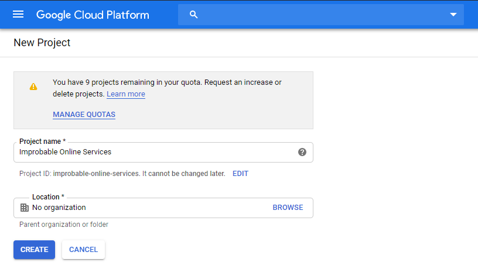

# Quickstart

This is our Quickstart guide. We'll get you up and running as quickly as we can. We're going to deploy the Gateway and PlayFab auth services as an example, but you should be able to extend these instructions to any other included services.

## Prerequisites

We're going to be using Google Cloud for this example. You can adapt these instructions to whatever you want - as long as it provides a [Kubernetes](https://kubernetes.io/) cluster. Don't worry if you don't know what Kubernetes is yet.

There are a few things you'll need to install.

- [Docker](https://docs.docker.com/install/) - to build the images.
- [Google Cloud SDK](https://cloud.google.com/sdk/) - we use this tool to push built images up to our Google Cloud project.
- [Terraform](https://www.terraform.io/) - we use this to configure the different cloud services we use.
- [kubectl](https://kubernetes.io/docs/tasks/tools/install-kubectl/) - used to deploy services to the cloud Kubernetes instance.

You'll also need to sign up for a [PlayFab](https://playfab.com/) account if you don't have one. It's free!

## Creating a Google Cloud project

Go to the [project creation page](https://console.cloud.google.com/projectcreate) on the Google Cloud console. Give your project a name - remember, it can't be changed later!

There's a field to put in an organisation too. It's OK to leave this as `No organization` if you don't need this project to be part of one.

It might take Google a couple of minutes to create your project. Once it's ready, open the navigation menu (the hamburger in the top-left) and go to **Kubernetes Engine**.

> Kubernetes Engine is Google's hosted Kubernetes offering. What is Kubernetes (or, commonly, k8s)?  It's a **container orchestration service**. Essentially, you give it some containerized applications, and some configuration, and it ensures your application stays up.  
> 
> For example, if a given container is defined as having 3 replicas, Kubernetes will start up 3 instances of that container. If one of them falls over or is stopped, Kubernetes will immediately start up another one for you.
>
> Don't worry if this doesn't make sense yet; you'll be walked through the whole thing.

Kubernetes Engine isn't free, but you can sign up to the free trial if you need to. You'll know it's ready to go when you can see this dialog box:

It's possible to do a lot through Google Cloud's web console, but for this step we're going to use Terraform.

## Creating your infrastructure

[Terraform](https://www.terraform.io/) is a tool for configuring cloud infrastructure at a high level. It's a bit like a list of ingredients. In this case we want:

- A Kubernetes cluster.
- A MemoryStore instance (Google's hosted Redis), for the Gateway to use as a queue.

Our example configs are stored in [`/services/terraform`](../services/terraform). The files are:

- `variables.tf` - variables used for configuration, such as your Google Cloud project ID. You can define these in this configuration file, or leave them blank and provide them when you run `terraform plan` (we'll get there in a second).
- `provider.tf` - this file tells Terraform which cloud provider we're using.
- `gke.tf` - this instructs Terraform how to build our Kubernetes cluster.
- `memorystore.tf` - this defines the Google MemoryStore (Redis) instance.

You don't need to edit any files - run `terraform init` in this directory to ensure the right plugins are installed, then run `terraform plan -out "my_plan"`.

You'll be asked for some variables:
- Your cloud project ID. Note that this is the ID, not the display name.
- A zone; pick one from [here](https://cloud.google.com/compute/docs/regions-zones/), ensuring you pick a zone and not a region.
- A name for your cluster. This will be used in the name of the queue, too. You can put whatever you like here.

Terraform will print out a list of everything it's planning to configure for you, and store this as a file with whatever name you gave it earlier in place of `"my_plan"`.

You can review the plan by running `terraform show "my_plan"`.

Once you're ready to deploy, run `terraform apply "my_plan"`. This will take a few minutes. Once it's done, Terraform will print any output variables we defined in the configuration; in our case, that's the host IP of the new Redis instance.  
Make a note of it - we'll need it later. Or you can view outputs again by running `terraform output`.